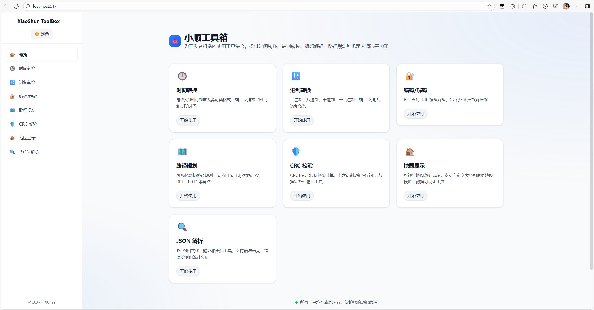
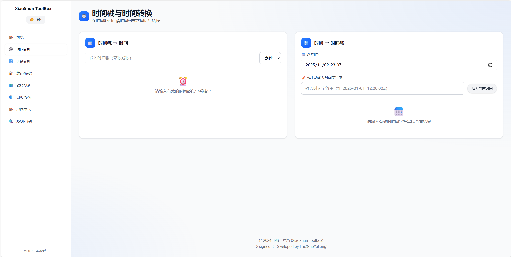
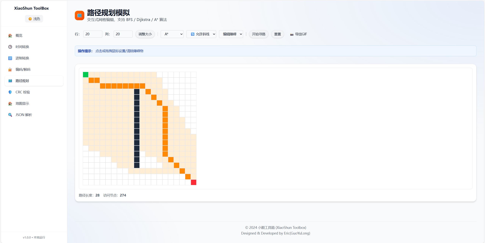

# 小顺工具箱 | XiaoShun Toolbox

<div align="center">


**现代化开发者工具集合 | Modern Developer Toolkit**

[](https://reactjs.org/)
[](https://www.typescriptlang.org/)
[](https://tailwindcss.com/)
[](https://vitejs.dev/)

[🌐 在线体验](https://your-demo-url.com) | [📖 文档](./docs/) | [🐛 问题反馈](https://github.com/your-username/xiaoshun-toolbox/issues)

</div>

---

## 📖 简介 | Introduction

**中文**

小顺工具箱是一个现代化的开发者工具集合，为程序员和工程师提供日常开发中常用的转换、编码、调试和可视化工具。项目采用 React + TypeScript + Tailwind CSS 技术栈，提供美观的界面和流畅的用户体验。

**English**

XiaoShun Toolbox is a modern collection of developer tools that provides commonly used conversion, encoding, debugging, and visualization tools for programmers and engineers. Built with React + TypeScript + Tailwind CSS, offering a beautiful interface and smooth user experience.

---

## 📸 项目截图 | Screenshots

### 🏠 主页界面 | Home Interface
<div align="center">

<p><em>现代化的主页设计，展示所有可用工具</em></p>
</div>

### 🕒 时间转换工具 | Time Conversion Tool
<div align="center">

<p><em>直观的时间戳转换界面，支持多种格式</em></p>
</div>

### 🗺️ 路径规划工具 | Path Planning Tool
<div align="center">

<p><em>交互式路径规划可视化，支持多种算法</em></p>
</div>

### 🌙 深色模式 | Dark Mode
<div align="center">

<p><em>优雅的深色主题，保护眼睛的同时保持美观</em></p>
</div>

---

## ✨ 功能特性 | Features

### 🕒 时间转换工具 | Time Conversion Tool
- **时间戳转换** | Timestamp conversion: 毫秒/秒级时间戳与可读时间格式双向转换
- **多格式支持** | Multiple formats: ISO 8601 和本地时间格式
- **一键操作** | One-click operations: 快速复制结果和填入当前时间

### 🔢 进制转换工具 | Base Conversion Tool
- **多进制转换** | Multi-base conversion: 二进制、八进制、十进制、十六进制互转
- **大数支持** | BigInt support: 处理大整数和负数
- **字节视图** | Byte viewer: ASCII 字符串与十六进制双向转换

### 🔐 编码/解码工具 | Encoding/Decoding Tool
- **Base64 编码** | Base64 encoding: 文本与 Base64 格式双向转换
- **URL 编码** | URL encoding: URL 安全字符编码和解码
- **压缩工具** | Compression: Gzip/Zlib 压缩和解压缩

### 🗺️ 路径规划工具 | Path Planning Tool
- **多种算法** | Multiple algorithms: BFS、Dijkstra、A* 算法支持
- **可视化界面** | Visual interface: 交互式网格编辑器
- **实时计算** | Real-time calculation: 自动计算最优路径并显示

### 🤖 机器人调试工具 | Robotics Debugging Tool
- **CRC 校验** | CRC verification: CRC16-IBM 和 CRC32-IEEE 校验和计算
- **十六进制分析** | Hex analysis: 十六进制数据查看和分析

### 🏠 地图显示工具 | Map Display Tool
- **数据可视化** | Data visualization: 地图数据展示和家庭地图模拟
- **自定义配置** | Custom configuration: 支持自定义大小和数据导入

### 🔍 JSON 解析工具 | JSON Parser Tool
- **格式化美化** | Format & beautify: JSON 格式化、验证和美化
- **语法高亮** | Syntax highlighting: 支持语法高亮和错误检测
- **统计分析** | Statistical analysis: 提供详细的数据统计信息

---

## 🚀 快速开始 | Quick Start

### 环境要求 | Prerequisites

- Node.js >= 18.0.0
- npm >= 9.0.0

### 安装运行 | Installation & Running

```bash
# 克隆项目 | Clone the repository
git clone https://github.com/your-username/xiaoshun-toolbox.git
cd xiaoshun-toolbox

# 安装依赖 | Install dependencies
npm install

# 启动开发服务器 | Start development server
npm run dev

# 构建生产版本 | Build for production
npm run build

# 预览生产版本 | Preview production build
npm run preview
```

---

## 🛠️ 技术栈 | Tech Stack

### 前端框架 | Frontend Framework
- **React 19.1.1** - 用户界面库
- **TypeScript 5.9.3** - 类型安全的 JavaScript
- **Vite 7.1.14** - 现代化构建工具

### 样式方案 | Styling
- **Tailwind CSS 4.1.16** - 实用优先的 CSS 框架
- **PostCSS** - CSS 后处理器

### 路由管理 | Routing
- **React Router DOM 7.9.5** - 声明式路由

### 工具库 | Utilities
- **Pako** - Gzip/Zlib 压缩库
- **JSZip** - ZIP 文件处理
- **GIF.js** - GIF 动画生成

---

## 📁 项目结构 | Project Structure

```
src/
├── components/          # 通用组件 | Common components
│   └── ui/             # UI 组件库 | UI component library
├── pages/              # 页面组件 | Page components
│   ├── Home.tsx            # 主页 | Home page
│   ├── TimeTool.tsx        # 时间转换工具 | Time conversion tool
│   ├── BaseConvertTool.tsx # 进制转换工具 | Base conversion tool
│   ├── EncodingTool.tsx    # 编码解码工具 | Encoding/decoding tool
│   ├── PathPlanningTool.tsx# 路径规划工具 | Path planning tool
│   ├── RoboticsTool.tsx    # 机器人调试工具 | Robotics debugging tool
│   ├── MapTool.tsx         # 地图显示工具 | Map display tool
│   └── JsonTool.tsx        # JSON 解析工具 | JSON parser tool
├── utils/              # 工具函数 | Utility functions
│   ├── time.ts             # 时间处理 | Time utilities
│   ├── base.ts             # 进制转换 | Base conversion
│   ├── encoding.ts         # 编码解码 | Encoding/decoding
│   ├── pathfinding.ts      # 路径规划算法 | Pathfinding algorithms
│   └── crc.ts              # CRC 校验 | CRC verification
├── App.tsx             # 主应用组件 | Main app component
├── main.tsx            # 应用入口 | App entry point
└── index.css           # 全局样式 | Global styles
```

---

## 🚀 部署指南 | Deployment Guide

### 📦 构建生产版本 | Build for Production

```bash
# 构建生产版本
npm run build

# 预览构建结果（可选）
npm run preview
```

构建完成后，所有静态文件将生成在 `dist/` 目录中。

### 🌐 部署选项 | Deployment Options

#### 1. **Vercel 部署** (推荐)

```bash
# 安装 Vercel CLI
npm i -g vercel

# 部署到 Vercel
vercel --prod
```

或者直接连接 GitHub 仓库到 Vercel 进行自动部署。

#### 2. **Netlify 部署**

```bash
# 安装 Netlify CLI
npm install -g netlify-cli

# 部署到 Netlify
netlify deploy --prod --dir=dist
```

或者将 `dist` 文件夹拖拽到 Netlify 控制台。

#### 3. **GitHub Pages 部署**

在 `package.json` 中添加部署脚本：

```json
{
  "scripts": {
    "deploy": "gh-pages -d dist"
  }
}
```

```bash
# 安装 gh-pages
npm install --save-dev gh-pages

# 部署到 GitHub Pages
npm run deploy
```

#### 4. **Docker 部署**

创建 `Dockerfile`：

```dockerfile
FROM nginx:alpine
COPY dist /usr/share/nginx/html
EXPOSE 80
CMD ["nginx", "-g", "daemon off;"]
```

```bash
# 构建 Docker 镜像
docker build -t xiaoshun-toolbox .

# 运行容器
docker run -p 80:80 xiaoshun-toolbox
```

#### 5. **传统服务器部署**

将 `dist` 文件夹中的所有文件上传到你的 Web 服务器根目录。

**Nginx 配置示例：**

```nginx
server {
    listen 80;
    server_name your-domain.com;
    root /path/to/dist;
    index index.html;

    location / {
        try_files $uri $uri/ /index.html;
    }

    # 启用 gzip 压缩
    gzip on;
    gzip_types text/plain text/css application/json application/javascript text/xml application/xml application/xml+rss text/javascript;
}
```

### ⚙️ 环境变量配置 | Environment Variables

如果需要配置环境变量，创建 `.env.production` 文件：

```env
VITE_APP_TITLE=小顺工具箱
VITE_API_BASE_URL=https://api.your-domain.com
```

### 🔧 构建优化 | Build Optimization

项目已包含以下优化配置：

- **代码分割**: 自动分割第三方库和应用代码
- **资源压缩**: CSS/JS 文件自动压缩
- **Tree Shaking**: 移除未使用的代码
- **缓存优化**: 文件名包含哈希值，便于缓存管理

### 📊 构建分析 | Bundle Analysis

```bash
# 分析构建包大小
npm run build -- --analyze
```

---

## 🎨 自定义配置 | Customization

### 主题配置 | Theme Configuration

项目支持深色/浅色模式切换，可在 `tailwind.config.js` 中自定义品牌色彩：

```javascript
colors: {
  brand: {
    50: '#eff6ff',
    500: '#3b82f6',
    600: '#2563eb',
    700: '#1d4ed8',
  }
}
```

### 算法配置 | Algorithm Configuration

路径规划工具支持多种算法，可根据需要扩展：
- **BFS**: 适合无权重图的最短路径
- **Dijkstra**: 适合有权重图的最短路径  
- **A***: 启发式搜索，通常最高效

---

## 📝 开发指南 | Development Guide

### 代码规范 | Code Standards
- 使用 ESLint 进行代码检查
- 遵循 TypeScript 严格模式
- 组件采用函数式编程风格

### 提交规范 | Commit Convention
```
feat: 新功能
fix: 修复问题
docs: 文档更新
style: 代码格式调整
refactor: 代码重构
test: 测试相关
chore: 构建/工具链更新
```

---

## 🤝 贡献指南 | Contributing

我们欢迎所有形式的贡献！

### 如何贡献 | How to Contribute

1. **Fork** 本仓库
2. 创建特性分支 (`git checkout -b feature/AmazingFeature`)
3. 提交更改 (`git commit -m 'Add some AmazingFeature'`)
4. 推送到分支 (`git push origin feature/AmazingFeature`)
5. 开启 **Pull Request**

### 问题反馈 | Issue Reporting

如果您发现了 bug 或有功能建议，请通过 [Issues](https://github.com/your-username/xiaoshun-toolbox/issues) 告诉我们。

---

## 📄 许可证 | License

本项目基于 [MIT License](LICENSE) 开源协议。

---

## 👨‍💻 作者 | Author

**Eric (GuoYuLong)**
- GitHub: [@Eric](https://github.com/guoyulong1)
- Email: guoyulong111@gmail.com

---

## 🙏 致谢 | Acknowledgments

感谢以下开源项目和社区的支持：

- [React](https://reactjs.org/) - 用户界面库
- [Tailwind CSS](https://tailwindcss.com/) - CSS 框架
- [Vite](https://vitejs.dev/) - 构建工具
- [TypeScript](https://www.typescriptlang.org/) - 类型系统

---

<div align="center">

**⭐ 如果这个项目对您有帮助，请给个 Star 支持一下！**

**⭐ If this project helps you, please give it a star!**

</div>
